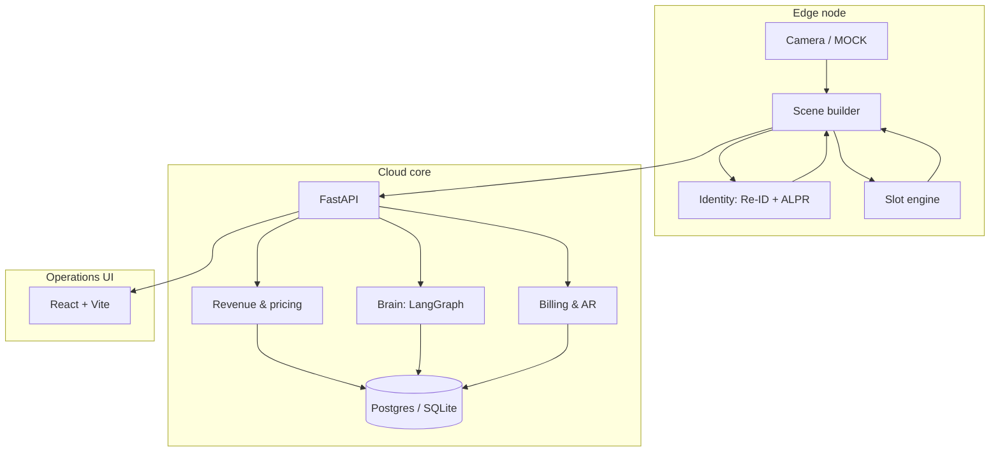
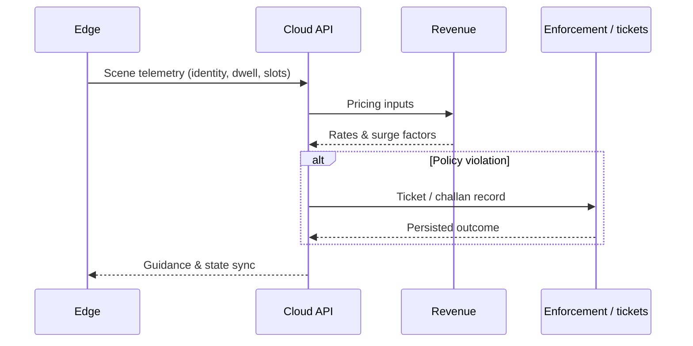

# ParkSight AI: Enterprise Parking Monetization & Cognitive Guidance


[]()
[]()
[]()

ParkSight AI is an edge-first intelligent parking platform: **computer vision** on the edge, **orchestration and revenue logic** in the cloud, and a **React** operations dashboard. The system combines YOLO-based detection, optional **ONNX** vehicle re-identification and license-plate recognition, **LangGraph** reasoning over **Groq**, and **PostgreSQL** (or SQLite locally) for persistence.

---

## Enterprise analytics gallery

High-level module visuals (marketing assets in `assets/`).

### Revenue & monetization

Occupancy-aware pricing, trend views, and localized earnings presentation.


### Enforcement & policy

Policy-driven violations, challans, and settlement-oriented workflows.


---

## System architecture

### Topology



### Revenue & enforcement (conceptual)



---

## Repository layout

| Path | Role |
|------|------|
| `cloud/api/` | FastAPI application: scenes, telemetry, analytics, revenue, reservations, **billing** |
| `cloud/api/billing_service.py` | Invoices, payments, parking sessions, AR-style summaries |
| `brain/` | LangGraph + Groq (`build_graph`) |
| `edge/` | Scene loop, YOLO detection, slot geometry, **identity** (ONNX or simulated / torch) |
| `edge/onnx_identity.py` | ONNX Runtime: OSNet Re-ID + LPRNet |
| `edge/plate_pipeline.py` | MNet plate detector + perspective warp (production-style ALPR chip) |
| `edge/models/` | Downloaded weights (YOLO / ONNX); **not** committed by default |
| `ui/` | Vite + React dashboard (`npm run dev` / `npm run build`) |
| `docker/` | `Dockerfile.api`, `Dockerfile.edge`, `Dockerfile.ui`, `nginx-ui.conf` (proxies `/api` to the API) |
| `download_models.py` | YOLO weights + ONNX bundles (Re-ID, LPRNet, MNet) into `edge/` and `edge/models/` |
| `infra/helm/` | Kubernetes Helm chart |
| `tests/` | Pytest: API, billing, brain, edge slot/scene, stack contract, optional live Groq smoke |

**Dependency entry points:** root **`requirements.txt`** (full stack including edge CV). **`cloud/api/requirements.txt`** targets the API Docker image. **`pyproject.toml`** names the `parksight-ai` package (`cloud*`, `edge*`, `brain*`) for editable installs.

---

## Capabilities (current)

### Revenue, enforcement, and billing

- **Dynamic pricing**: Occupancy-linked multipliers and policy hooks used by `/system/process` and revenue endpoints.
- **Enforcement**: Violation and ticketing flows surfaced in analytics and UI.
- **Billing & accounts receivable**: REST routes under `/billing/*` (invoices, payments, sessions, summaries) backed by SQLAlchemy models in the API layer; UI section for Billing & AR.

### Spatial & guidance

- Slot polygons (Shapely), scene construction from detections, pathfinding and broadcast-style messaging in API responses.

### Identity & ALPR

| Mode | When | Notes |
|------|------|--------|
| **ONNX (recommended)** | `PARKSIGHT_IDENTITY_MODE=auto` and `edge/models/vehicle_reid_osnet.onnx` present | OSNet-style **512-D** embeddings; **MNet** (`mnet_plate.onnx`) for detect + warp when available, then **LPRNet** (`lprnet.onnx`); ROI resize fallback if no plate chip. |
| **Torch** | `PARKSIGHT_IDENTITY_MODE=torch` | ResNet18 embeddings; optional **EasyOCR** via `ALPR_EASYOCR=1`. |
| **Simulated** | No ONNX weights, or explicit `simulated` | Deterministic demo vectors for development. |

Weights: run **`python download_models.py`** from the repo root (YOLO + ONNX files into `edge/` and `edge/models/`). In Docker Compose, mount **`parksight-models`** to `/app/edge/models` so ONNX files survive container rebuilds.

---

## Technology stack

- **Vision**: Ultralytics YOLO11 (and optional YOLOv8 fallback weights), OpenCV headless, Shapely.
- **ONNX inference**: `onnxruntime` for Re-ID and LPR (CPU execution provider by default in code paths).
- **Brain**: LangGraph + **langchain-groq** (default model family: Llama 3.3 on Groq). Without `GROQ_API_KEY`, the API uses deterministic fallbacks where implemented.
- **Backend**: FastAPI, Pydantic v2, SQLAlchemy 2.x, `uvicorn`.
- **Data**: SQLite via `DATABASE_URL` for local dev; **PostgreSQL 15** in Compose for the `api` service.
- **UI**: React 18, Vite 4, Framer Motion, Lucide; dev server proxies `/api` → `http://localhost:8000`; production UI image uses **nginx** per `docker/nginx-ui.conf`.

---

## Prerequisites

- **Python** 3.9+ (3.10+ recommended; Dockerfiles use 3.10)
- **Node.js** 18+ for the UI
- **Docker** + Docker Compose (optional, for full stack)

---

## Environment variables

Create a **`.env`** at the repository root (Compose reads it for substitution) or export variables in your shell.

| Variable | Purpose |
|----------|---------|
| `GROQ_API_KEY` | Enables Groq-backed LangGraph paths on `POST /system/process`. Omit for offline operation; one pytest case calls the live API when this key **and** network are available. |
| `DATABASE_URL` | SQLAlchemy URL. Example: `sqlite:///./parksight.db` locally; Compose sets Postgres for `api`. |
| `API_URL` | Edge ingest URL (default `http://localhost:8000/system/process`). In Compose: `http://api:8000/system/process`. |
| `CAMERA_SOURCE` | Edge input: `MOCK` (default), or a video file path (e.g. `.mp4`). Optional `edge/configs/kaggle_config.json` for slot geometry. |
| `PARKSIGHT_IDENTITY_MODE` | `auto` (default), `onnx`, `torch`, or `simulated`. See identity table above. |
| `PARKSIGHT_IDENTITY_IMAGENET` | `1` to use pretrained ImageNet weights for ResNet18 (torch path only). |
| `ALPR_EASYOCR` | `1` to attempt EasyOCR on the torch path (extra dependency). |
| `PARKSIGHT_REQUIRE_AUTH` | `1` to require `Authorization: Bearer <JWT>` (or `PARKSIGHT_SERVICE_BEARER`) on all routes except `/health`, `/metrics`, `/docs`, `/auth/token`, `/auth/login`. Default **off** for local DX. |
| `PARKSIGHT_JWT_SECRET` | **Required** when `PARKSIGHT_REQUIRE_AUTH=1`. HS256 signing key. |
| `PARKSIGHT_SERVICE_BEARER` | Optional static bearer for the **edge** service (same value in `edge` + `api` Compose env). Operators use `/auth/login` from the UI. |
| `PARKSIGHT_ADMIN_EMAIL` / `PARKSIGHT_ADMIN_PASSWORD` | Seed the first **admin** user when `api_users` is empty (defaults in `cloud/api/security.py`). |
| `PARKSIGHT_OPERATOR_EMAIL` / `PARKSIGHT_OPERATOR_PASSWORD` | Optional second user with **operator** role. |
| `PARKSIGHT_CALIBRATION_PATH` | Where `POST /calibration/slot-config` writes JSON (default `edge/configs/kaggle_config.json`). |
| `PARKSIGHT_CORS_ORIGINS` | Comma-separated origins for CORS (default `*`). |
| `SENTRY_DSN` | Optional Sentry SDK initialization on API startup. |

---

## Quick start (local)

### 1. Python environment

```bash
python3 -m venv .venv
source .venv/bin/activate   # Windows: .venv\Scripts\activate
pip install -r requirements.txt
pip install -e .   # optional: editable package install
```

Run Python modules from the **repository root** so `cloud`, `edge`, and `brain` resolve.

### 2. Models (optional but recommended for real CV)

```bash
python download_models.py
```

### 3. `.env` (minimal local)

```env
GROQ_API_KEY=your_key_here   # optional
DATABASE_URL=sqlite:///./parksight.db
```

### 4. Run processes

```bash
# Terminal 1: API
python3 -m cloud.api.main

# Terminal 2: Edge (posts scenes to the API)
python3 -m edge.main

# Terminal 3: UI — http://localhost:5173 (Vite proxies /api → :8000)
cd ui && npm install && npm run dev
```

- **API**: `http://localhost:8000` — `GET /health`, `POST /system/process`, plus analytics, revenue, and **`/billing/*`** routes.
- **UI**: `http://localhost:5173`

`POST /system/process` returns structured JSON including guidance, revenue context, and violations, depending on configuration and data.

---

## Docker Compose

Full stack: **Postgres**, **API**, **edge worker**, **UI** (nginx on host **3000** → app on **80** inside the container).

```bash
export GROQ_API_KEY=your_key_here   # optional
docker compose up --build
```

| Service | Host ports | Notes |
|---------|------------|--------|
| `db` | 5432 | Postgres; user/password/database `parksight` / `parksight` / `parksight_db` |
| `api` | 8000 | FastAPI |
| `ui` | 3000 | Static build + **`/api` → API** via `docker/nginx-ui.conf` |
| `edge` | — | `python -m edge.main`; image installs the full edge stack (**first build can be lengthy** due to PyTorch / Ultralytics). |

**Volumes:** `parksight-telemetry` (API telemetry dir), **`parksight-models`** → `/app/edge/models` (persist ONNX weights across rebuilds), **`./edge/configs:/app/edge/configs`** on the API service so the **calibration wizard** can write `kaggle_config.json` where the edge container reads it.

```bash
CAMERA_SOURCE=MOCK docker compose up
```

Kubernetes assets: **`infra/helm/`**.

---

## Development and verification

```bash
# Python (from repo root, venv active)
pytest tests/ -q

# UI production bundle
cd ui && npm ci && npm run build
```

**Compose file validation:** `docker compose config -q`

**Notes:**

- Prefer running tests with **network enabled** if `GROQ_API_KEY` is set, so the optional live Groq smoke test can reach the API.
- Some tests are **skipped** when optional ONNX files are absent; CI or local runs with `edge/models/` populated exercise the full identity path.

---

## API surface (non-exhaustive)

| Area | Examples |
|------|-----------|
| Core | `GET /health`, `POST /system/process` |
| Telemetry & analytics | `GET /telemetry/summary`, heatmap, violations, forecast |
| Revenue | `GET /revenue/summary`, `GET /revenue/tickets` |
| Reservations | `POST /reserve`, `GET /reservations/active` |
| Billing | `GET /billing/summary`, `GET/POST /billing/invoices`, payments, sessions |
| Auth | `POST /auth/token`, `POST /auth/login`, `GET /auth/me` |
| Calibration | `POST /calibration/homography`, `POST /calibration/slot-config`, `GET /calibration/slot-config` |
| Observability | `GET /metrics`, `POST /monitoring/heartbeat`, `GET /monitoring/edge-status` |

Refer to `cloud/api/main.py` for the authoritative route list and request bodies.

---

## Security, calibration, and observability (MVP polish)

### API authentication (JWT + roles)

- **OAuth2 password** compatibility: `POST /auth/token` (form `username` / `password`) or **`POST /auth/login`** JSON `{ "email", "password" }`.
- **JWT** includes `sub` (email) and `role` (`admin` | `operator`). **`POST /billing/invoices/{id}/void`** requires **admin**.
- Enable with **`PARKSIGHT_REQUIRE_AUTH=1`** and set **`PARKSIGHT_JWT_SECRET`**. Edge nodes should set **`PARKSIGHT_SERVICE_BEARER`** to the same opaque string on API and edge so `POST /system/process` and `GET /reservations/active` succeed without interactive login.
- The React dashboard stores the bearer in **`localStorage`** (`parksight_token`) after sign-in under **Global Config**.

### Slot calibration wizard (UI)

- **Calibration** view: upload a reference frame, click to outline each slot polygon, set **camera id**, then **Save to edge config** (calls `POST /calibration/slot-config`, **admin** when auth is on).
- **Homography**: optional `POST /calibration/homography` with four source and four destination points (numpy DLT); result can be pasted or applied before save.

### Metrics and Sentry

- **`GET /metrics`** — Prometheus exposition (via `prometheus-fastapi-instrumentator` when installed).
- **`POST /monitoring/heartbeat`** — edge / process liveness and optional **fps** (Prometheus gauges); requires the same auth as the rest of the API when `PARKSIGHT_REQUIRE_AUTH=1`.
- **`SENTRY_DSN`** — optional error reporting on startup.

### Open-source license

Application source in this repository is licensed under the **Apache License 2.0** (see **`LICENSE`**). Third-party ONNX weights are subject to their upstream licenses (`download_models.py` URLs).

---

## Roadmap

- [x] Identity: ALPR (LPRNet + optional MNet warp) and cross-camera Re-ID (ONNX OSNet path).
- [x] Spatial: overlays, guidance, and facility messaging in API/UI.
- [x] Predictive & reservations: forecasting and reservation endpoints.
- [x] Monetization: dynamic pricing and enforcement ticketing.
- [x] Billing & AR: invoices, payments, parking sessions, dashboard hooks.
- [x] **MVP polish (phase 1):** JWT auth + roles, calibration API + UI wizard, Prometheus `/metrics`, Sentry hook, edge service bearer, Apache-2.0 license.
- [ ] Multi-site clustering, mobile payments, and deeper payment-provider integrations (V5+).

---

## Third-party model weights

ONNX sample weights are downloaded from public GitHub repositories (see URLs in `download_models.py`). Verify license terms for your deployment before redistributing weights or derived models.
