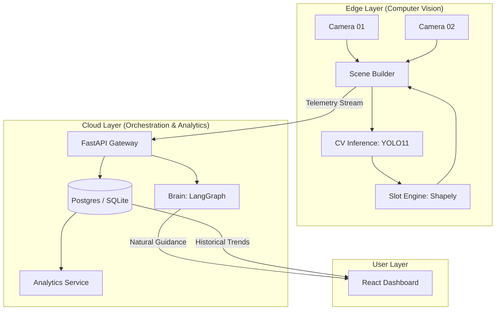
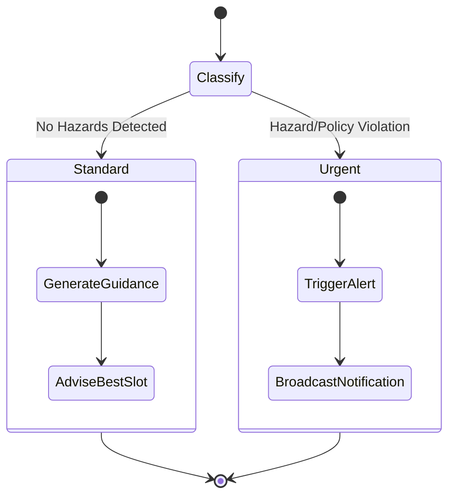
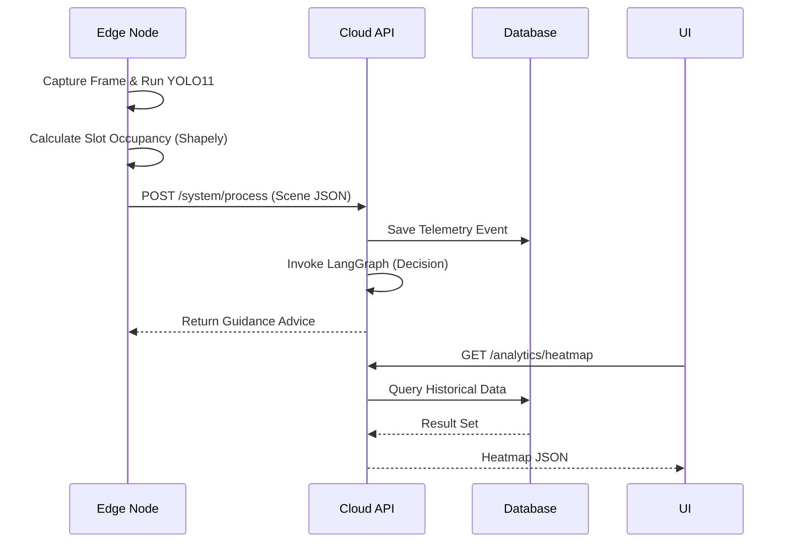

# ParkSight AI: Enterprise Parking Guidance & Analytics

[]()
[]()
[]()

ParkSight AI is an enterprise-grade, edge-first intelligent parking guidance system designed for high-scale environments. It combines **YOLO11** computer vision, **Shapely** geometry for precision slot detection, and a **LangGraph-based Brain** for explainable, safety-critical decision orchestration.

---

## 🏗️ System Architecture

### 1. High-Level Topology
ParkSight uses an edge-orchestrator pattern to minimize latency and maximize privacy.



### 2. AI Decision Flow (Orchestration)
The system differentiates between **STANDARD** guidance and **URGENT** safety alerts using a state-aware decision tree.



### 3. Telemetry Sequence
How a raw frame becomes a management insight.



---

## 🚀 Enterprise Features

### 📡 Multi-Camera Intelligence
- **Scene Fusion**: Supports multiple cameras per edge node with shared inference resources.
- **Deterministic Simulation**: V1.1 includes a time-based cyclic pattern for testing overstays and safety hazards without randomness.

### 🧠 Explainable AI
- **LangGraph Brain**: Uses a conditional state graph to route "URGENT" alerts (e.g., Pedestrian in Zone) separately from "STANDARD" guidance.
- **Natural Language Steering**: Provides high-quality instructions based on top-down Euclidean distance mapping.

### 📊 Persistent Analytics
- **SQL Backend**: Full **SQLAlchemy** integration for reliable, persistent historical data.
- **Heatmaps & Trends**: High-performance calculations for slot utilization and peak hour analysis.

---

## 🚦 Getting Started

### 1. Installation
The project is properly packaged. From the root directory:

```bash
# Set up environment
python3 -m venv .venv
source .venv/bin/activate
pip install -e .
```

### 2. Running Services
Start the Cloud API first (requires `GROQ_API_KEY` for AI features):

```bash
# Cloud API
python3 -m cloud.api.main

# Edge Node (Simulated Multi-Camera)
python3 -m edge.scene_builder
```

### 3. Testing
Our enterprise-grade test suite ensures 100% logic validation.

```bash
pytest tests/
```

---

## 🗺️ Roadmap
- [x] **V1.1 (Production Ready)**: Multi-camera, SQL Persistence, Proper Packaging.
- [ ] **V1.2 (Spatial Awareness)**: Dynamic UI overlay for mobile-first parking navigation.
- [ ] **V2.0 (Identity)**: ALPR (License Plate Recognition) & Re-ID across camera nodes.
