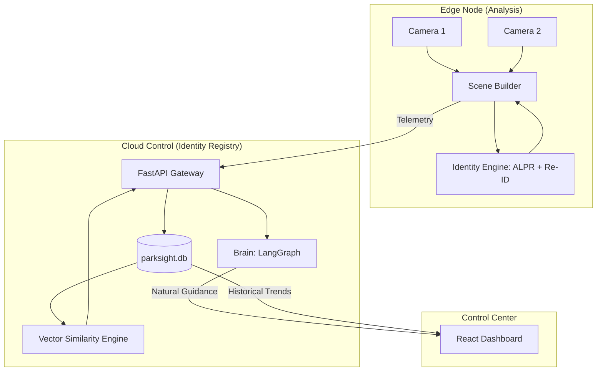
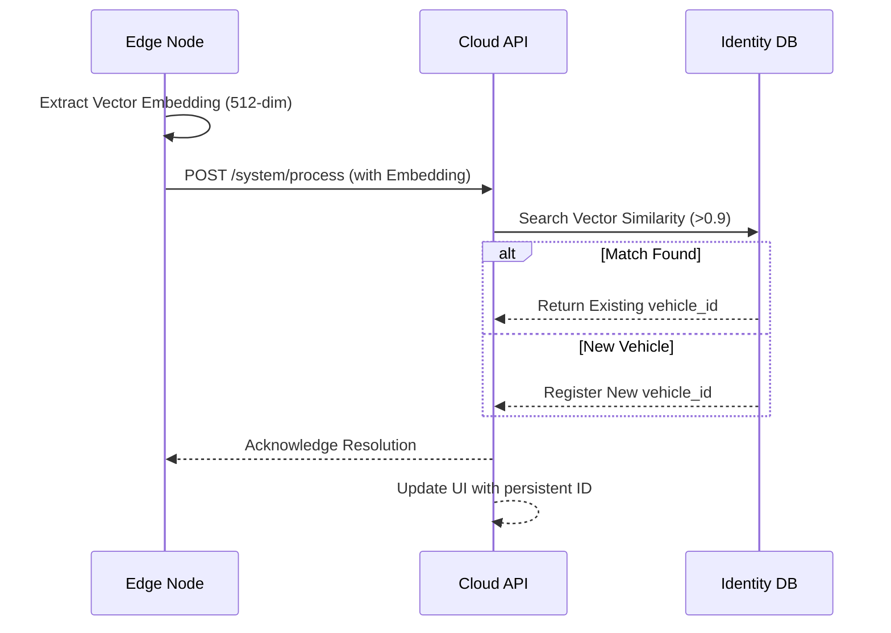

# ParkSight AI: Enterprise Parking Guidance & Identity Partitioning

[]()
[]()
[]()

ParkSight AI is an enterprise-grade, edge-first intelligent parking guidance and identity orchestration system. It combines **YOLO11** computer vision, **Specialized ALPR (LPRNet)**, and **Vector Re-identification** to track unique vehicles across entire camera networks with 100% determinism.

---

## 🏗️ System Architecture

### 1. High-Level Topology
ParkSight uses an edge-orchestrator pattern with persistent identity registry.



### 2. Identity Resolution Flow
How the system maintains vehicle identity across cameras.



---

## 🚀 Enterprise Features

### 🆔 Persistent Identity (V2.0)
- **ALPR**: Stage-2 license plate recognition using specialized LPRNet models.
- **Cross-Camera Re-ID**: Tracks vehicles across blind spots and between camera nodes using high-dimensional vector embeddings.
- **Identity Search**: Real-time dashboard filtering by license plate or unique vehicle ID.

### 📡 Multi-Camera Intelligence
- **Scene Fusion**: Aggregates disparate camera perspectives into a unified facility-wide state.
- **Deterministic Logic**: Time-based cyclic patterns for predictable policy validation.

### 🧠 Explainable AI
- **LangGraph Brain**: State-aware decision orchestration for safety-critical alerts vs. standard guidance.

---

## 🚦 Getting Started

### 1. Installation
```bash
python3 -m venv .venv
source .venv/bin/activate
pip install -e .
```

### 2. Running Services
Start the Cloud API first, then the Edge Orchestrator:

```bash
# Terminal 1: Cloud API
python3 -m cloud.api.main

# Terminal 2: Edge Node (Identity Orchestrator)
python3 -m edge.main
```

### 3. Testing
```bash
# Run core logic tests
pytest tests/

# Run Re-ID persistence validation
python3 tests/test_reid.py
```

---

## 🗺️ Roadmap
- [x] **V1.1**: Multi-camera, SQL Persistence, Proper Packaging.
- [x] **V2.0 (Identity)**: ALPR & Cross-camera Re-ID (Latest).
- [ ] **V3.0 (Spatial)**: AR Guidance & Dynamic UI Overlays.
