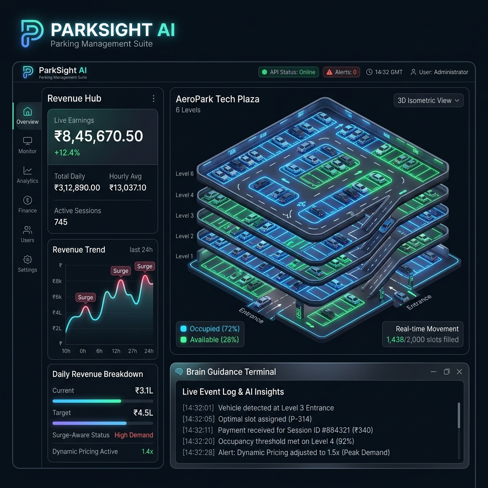
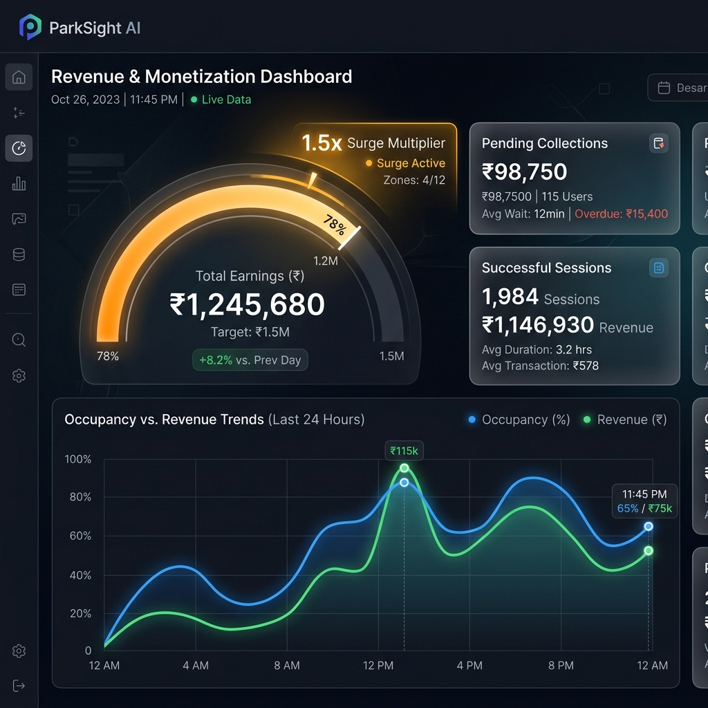
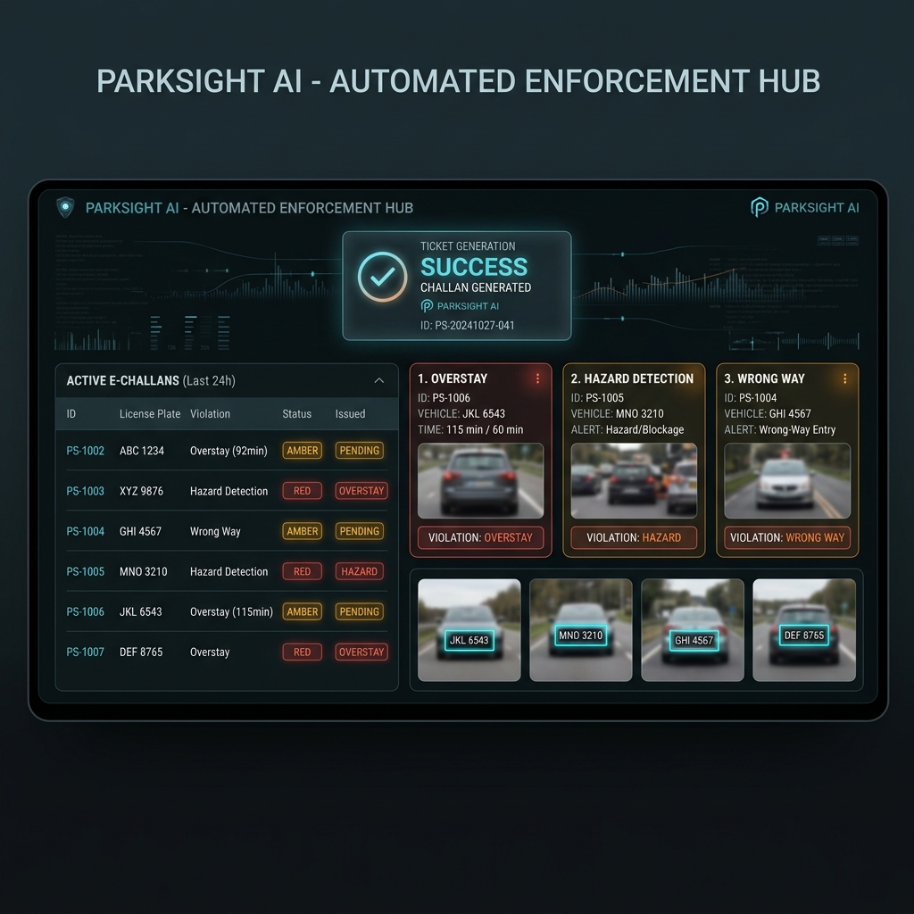
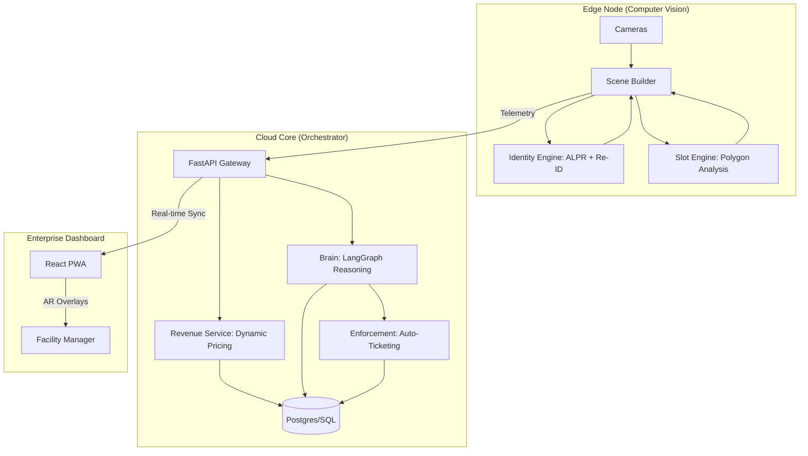
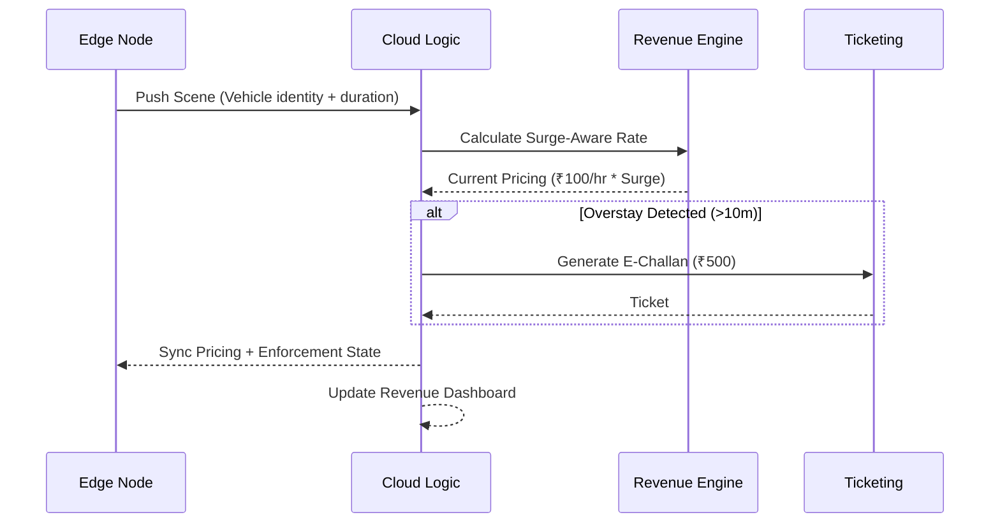

# ParkSight AI: Enterprise Parking Monetization & Cognitive Guidance



[]()
[]()
[]()

ParkSight AI is a commercial-grade, edge-first intelligent parking management suite. It evolves beyond simple monitoring into a **Revenue-Aware Orchestrator**, combining **YOLO11** computer vision, **Space-Aware Spatial Intelligence**, and **Cognitive Decision Brains** to automate facility monetization and driver guidance.

---

## 🏛️ Enterprise Analytics Gallery
Experience the full depth of the V4.0 Monetization & Enforcement suite through these high-fidelity module walkthroughs.

### 1. Spatial Control Hero
The primary orchestrator view combining 3D isometric mapping with real-time slot tenancy.


### 2. Revenue & Monetization Hub
Live financial tracking with surge-aware multipliers, occupancy vs. revenue trendlines, and currency-localized earnings.


### 3. Automated Enforcement Hub
The deterministic policy engine in action: tracking active E-Challans, resolving violation identities, and automating session settlements.


---

## 🏗️ System Architecture

### 1. High-Level Topology
ParkSight uses a tiered edge-to-cloud architecture with a high-fidelity cognitive layer.



### 2. Revenue & Enforcement Flow
How the system automates monetization and policy compliance.



---

## 🚀 Key Modules

### 💰 Revenue & Automation (V4.0)
- **Dynamic Pricing Engine**: Occupancy-aware surge pricing (1.5x) and EV priority incentives.
- **Automated Enforcement**: High-confidence e-challan generation for overstays and restricted zone violations with a 5-minute safety grace period.
- **Fiscal Analytics**: Real-time earnings tracking, pending collections, and enforcement registry.

### 📐 Spatial Intelligence (V3.0)
- **AR-Style Overlays**: Neon-glowing polygon overlays for live slot status visualization.
- **A* Pathfinding**: Realistic, aisle-aware navigation guidance for drivers.
- **Signage Broadcast**: LLM-driven public announcements for safety hazards and facility-wide status.

### 🆔 Persistent Identity (V2.0)
- **Specialized ALPR**: High-precision license plate recognition (LPRNet).
- **Vector Re-ID**: Tracking vehicles across cameras using 512-dim visual embeddings.
- **Identity Search**: Instant lookup by plate or unique vehicle ID.

---

## 🛠️ Technology Stack
- **Vision**: YOLO11 (Detection) + Shapely (Geometry) + LPRNet (ALPR).
- **Brain**: LangGraph (Decision Logic) + Groq (Llama-3.3-70b Reasoning).
- **Backend**: FastAPI (Python) + SQLAlchemy (Persistence) + Pydantic.
- **UI**: React 18 + Framer Motion (Animations) + Lucide Icons + Tailwind CSS.

---

## 🚦 Quick Start

### 1. Environment Configuration
Create a `.env` file in the root directory:
```env
GROQ_API_KEY=your_key_here
DATABASE_URL=sqlite:///./parksight.db
```

### 2. Running the Suite
```bash
# Terminal 1: Launch the Monetized Cloud API
python3 -m cloud.api.main

# Terminal 2: Launch the Identity Edge Node
python3 -m edge.main

# Terminal 3: Launch the Control Center
cd ui && npm run dev
```

---

## 🗺️ Enterprise Roadmap
- [x] **V2.0 (Identity)**: ALPR & Cross-camera Re-ID.
- [x] **V3.0 (Spatial)**: AR Guidance & Signage Broadcast.
- [x] **V3.5 (Predictive)**: Occupancy Forecasting & Reservations.
- [x] **V4.0 (Monetization)**: Dynamic Pricing & Automated E-Challans.
- [ ] **V5.0 (Global)**: Multi-site Cloud Clustering & Mobile Payments.
